Prerequisites
-------------
  * Python 3.8+ 
  * MySQL server (8.0.17+) [download link](https://dev.mysql.com/downloads/) or from [dockerimage](https://hub.docker.com/_/mysql) 
  * Application setup - please refer the upcoming section.

Application setup steps
------------

After completing the prerequisites setup follow the below steps to start using the application:

1. Download & extract or checkout the project from GitHub.
2. Navigate to the project root (loan_application) folder and install the required python libraries (preferrably from a virtual environment) 
~~~
    cd loan_application
    pip install -r requirements.txt
~~~
3. Create the user "aspireapp" with remote DB access. (Need to modify the credentials stored in config/settings.py if you are creating a user with other credentials)
~~~~
CREATE USER 'aspireapp'@'localhost' IDENTIFIED BY '@$p!repa55w0rD!';
CREATE DATABASE mini_aspire_app;
GRANT ALL ON mini_aspire_app.* TO 'aspireapp'@'localhost';
FLUSH PRIVILEGES;
~~~~
4. Login to the MySQL client and source the database schema file, present in the project root (loan_application/) 
~~~~~
source database_schema.sql
~~~~~
5. ER Diafram for the data model.

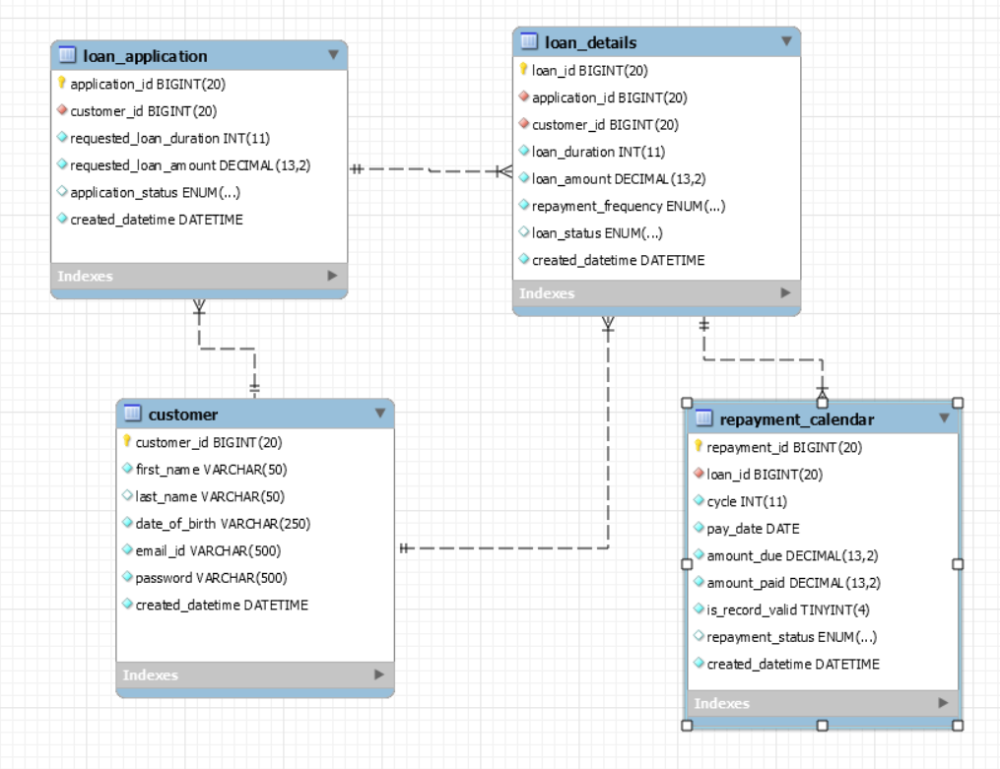

6. Set the Python path to 'src' directory.
~~~~~
cd src
export PYTHONPATH=$(pwd)
~~~~~
7. Now the Flask API server is lauched using the following comman
~~~~~
cd src
python services/app_routes.py
~~~~~
8. If the Flask App is launched without any issues the output in the terminal would be like the below screenshot.

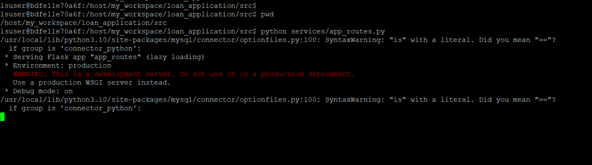

9. Various scenarios of the Aspire Loan Application are run with the help of scripts. These scripts can be executed in a new terminal window. When a new terminal or a new tab in the terminal is opened please export the PYTHONPATH again.

Decisions and Assumptions made as part of this project
----------
1. For the sake of time-contraint, it is assumed that a customer having a open loan or a pending loan application will not be allowed to apply for another loan application.
2. The only way a customer with an open loan can submit another loan application is by completing the repayments of the first loan.
3. Only Weekly pay-schedule is implemented.
4. For the sake of simplicity, it is assumed that the amount paid back by the customer will be <= to the outstanding principal. In real life if the customer had paid more tha the outstanding balance a refund would be initiated. But we are currently not implmenting the refund functionality.

Creating users to be used as part of the project
----------
1. To create users details which are further used for authentication in various stages of the application, follow the below steps,
2. Within the loan_application/ folder

~~~~
cd src/scripts/
python create_user.py
~~~~

3. The output of the above script will be as shown in the below screenshot,

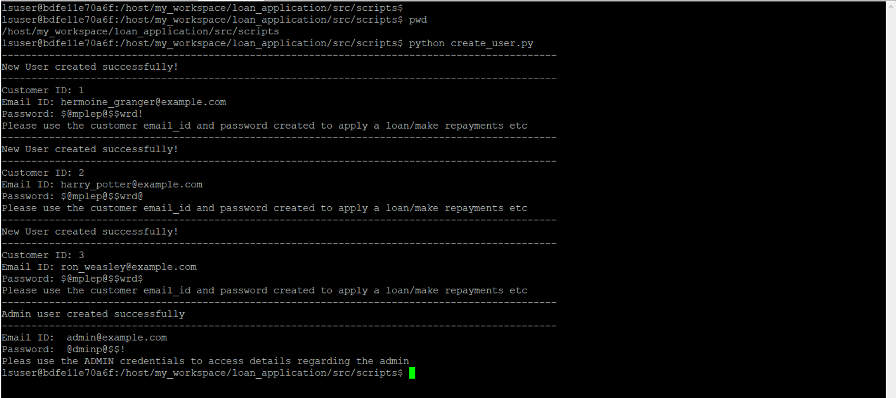

4. Please note down the email_id and password of atleast one of the users and the admin user.
5. The User data are stored in the Mysql Table `customer` as follows,

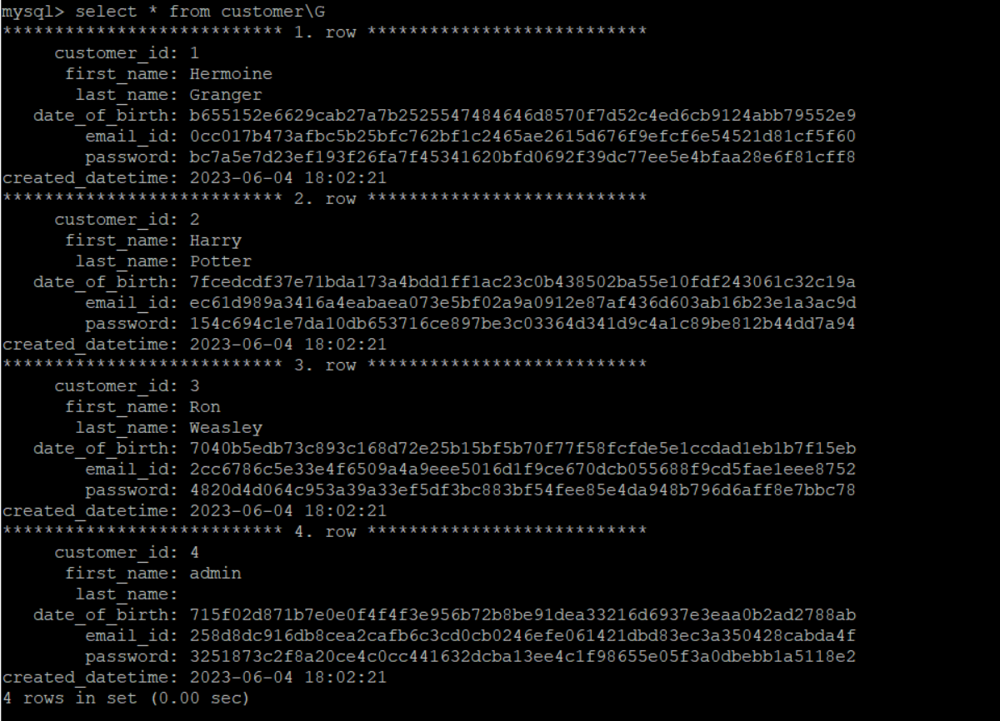


Running the application along with Demo Screens
----------

### Customer Account Home Script For Applying a Loan Application ###

The Customer Account Home script is designed to simulate the "Home/Account Dashboard" for existing users. 

~~~~~
cd src/scripts/
python customer_account_actions.py 
~~~~~

Notes:

1. The script will ask for the customer's emailid and password. Please use any of the user details generated by the create_user.py script.
2. Once the details are authenticated, if the user has no open loan then they will be prompted to fill a loan application.

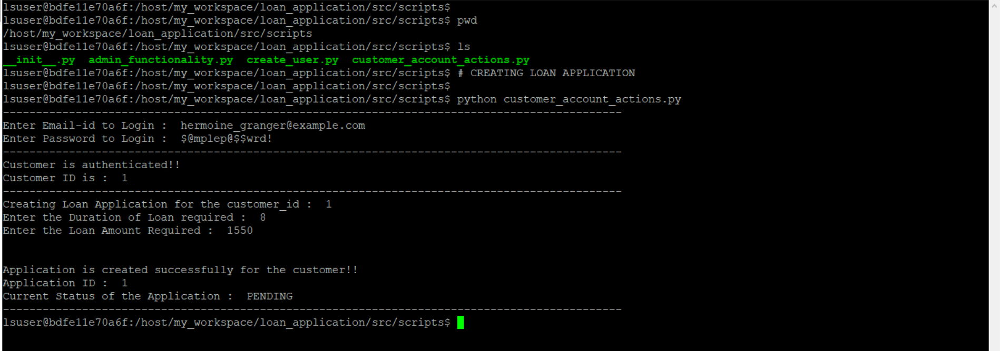

3. The application details are stored in the MySQL table `loan_application` with the status of the application as pending.

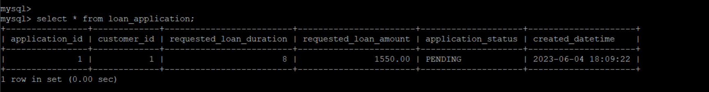

4. The access to change the status of the application to APPROVED or DECLINED lies with the admin.
5. While providing the emailid and password for authentication if any one of the detail is wrong then the user is not allowed to apply/view his application/loan.

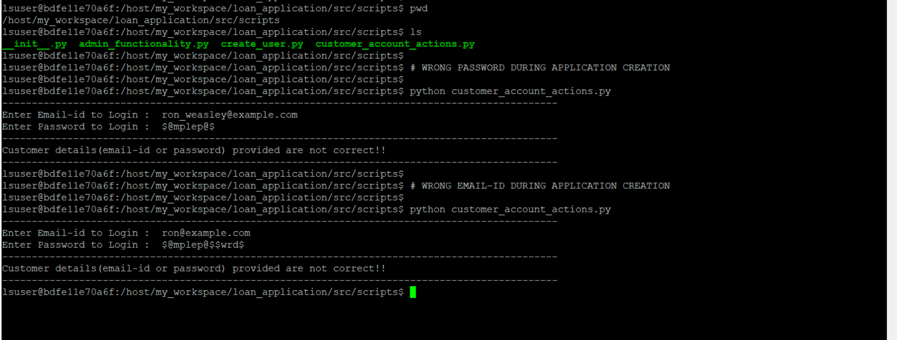

6. If the user logs in when the application status is still in PENDING, then he would see the same details displayed.

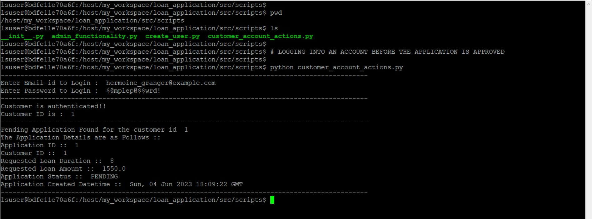

### Admin Functionality  ###

The Admin Functionality script is designed to simulate the various activities that can be done by an admin. 

~~~~~
cd src/scripts/
python admin_functionality.py 
~~~~~

Notes:

1. The script will ask for the customer's emailid and password. Please use any of the user details generated by the create_user.py script.
2. Once the details are authenticated, the admin has access to all the applications that are in PENDING state in the system.
3. The admin can decide if a particular application can be APPROVED or DECLINED.
4. If the application is APPROVED then a loan is created with a weekly repayment schedule based on the details obtained in the application.
5. If the application is DECLINED then the status of the application is changed and no loan is created.

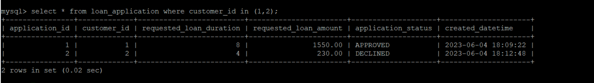


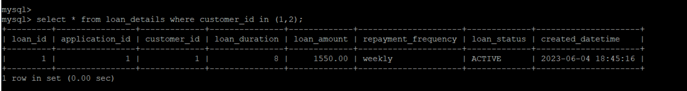


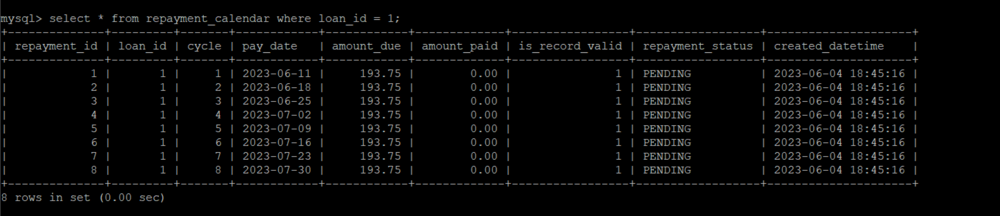


6. Similar to normal users, if the Admin provides the wrong emailid or password for authentication then they will not be allowed to access the admin panel.

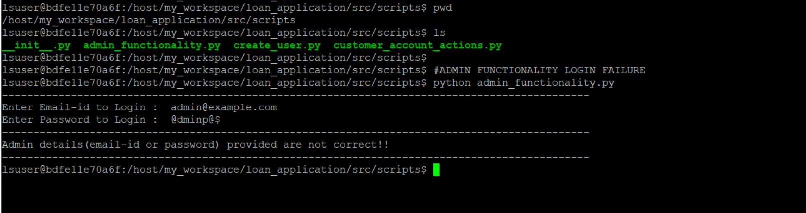

### Loan Repayment Functionality  ###

The Loan Repayment Functionality simulates the various repayment activity of a loan from the customer's home dashboard. 

~~~~~
cd src/scripts/
python customer_account_actions.py 
~~~~~

Notes:

1. The Loan Repayment Functionality is possible only after a loan and a loan repayment schedule is created.
2. The script will ask for the customer's emailid and password. Please use the user details that have an APPROVED application.
3. After the user details are authenticated, if the customer has a open loan then details regarding the same are displayed.
4. Also details regarding the upcoming loan repayment date, upcoming due amount, past cycle dues that were not cleared and outstanding principal balance is also displayed.
5. Based on the details, we can decide on the amount to the repaid.
6. The accounting of the repayment amount selected by the customer starts with the very first non-PENDING cycle in the repayment schedule.
7. If the amount due for the cycle is completely paid off then the repayment status moves to COMPLETED else the status will remain as PENDING.

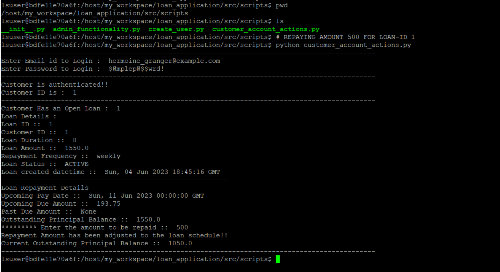


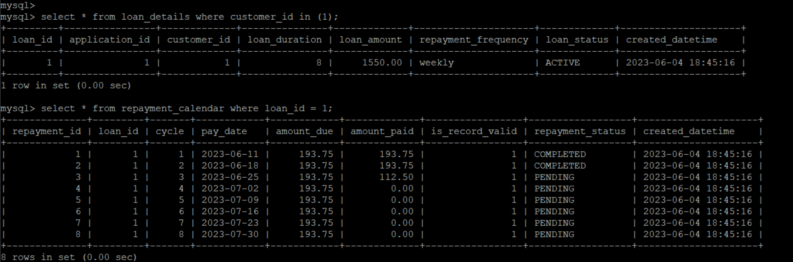


8. If all the cycle's due are COMPLETED, then the status of the loan changes to CLOSED-OFF and the customer become eligible for another new application.

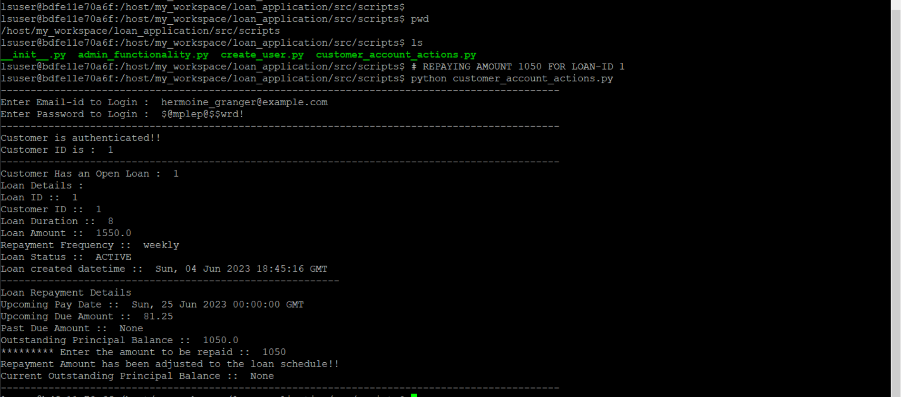


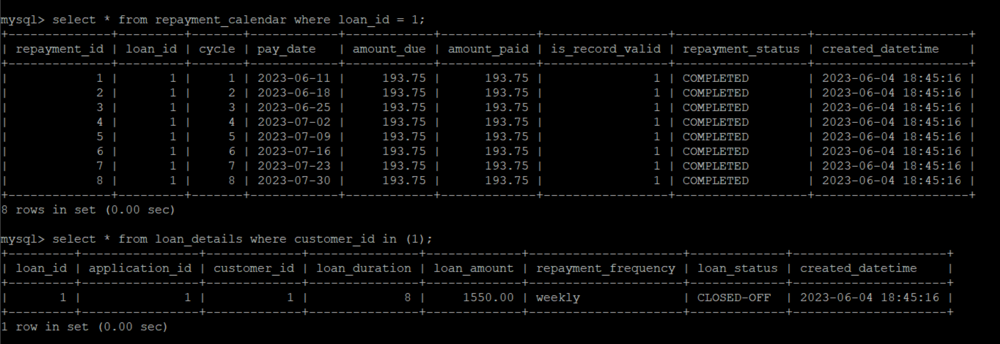


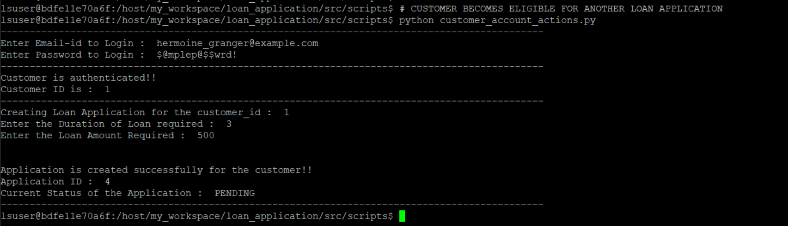


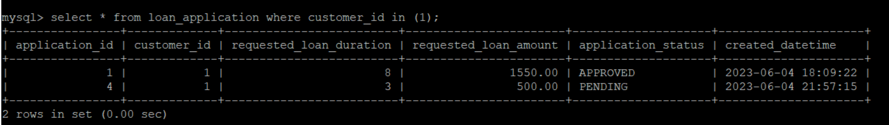


Note to Windows users
------------
Note for Windows users: Except the directory path and the python path setting, the other steps remain the same. Use  ```set pythonpath=<path\to\src>```.

Improvement areas
--------
1. Unit tests to be added.
2. Using a much more robust framework like django, reactjs to host the UI pages.
3. Maintaing a ledger table which would give the outstanding principal at a glance.
4. Including more logics and third party data to assess and approve an application automatically rather than waiting for admin interference.
5. Allowing multiple open loan for a customer at any point of time. Ensuring Accounting of the repayment amount is done properly when multiple loans are involved.
6. Including various loan schedules like monthly, bi-weeklt etc.
7. Introducing a concept of repayment dates auto-adjestments in case of bank holidays.
